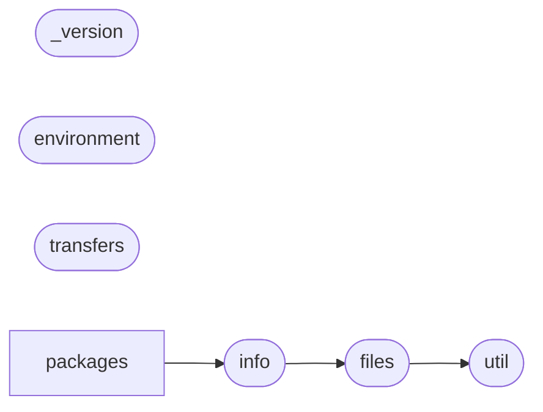

# Code Overview

[_Documentation generated by Documatic_](https://www.documatic.com)

<!---Documatic-section-Codebase Structure Python-start--->
## Codebase Structure Python

The codebase has a single-depth folder structure,
                with 8 code files in total.

<!---Documatic-block-system_architecture-start--->

<!---Documatic-block-system_architecture-end--->

# #
<!---Documatic-section-Codebase Structure Python-end--->

<!---Documatic-section-Important Functions-start--->
## Important Functions

<!---Documatic-block-important_funcs-start--->
<!---Documatic-block-most_used_funcs-start--->
### Most Utilised Functions

* [patchwork.util.set_runner](7-patchwork_util.md#patchwork.util.set_runner) (1 times)
* [patchwork.files.exists](4-patchwork_files.md#patchwork.files.exists) (1 times)
* [patchwork.info.distro_family](5-patchwork_info.md#patchwork.info.distro_family) (1 times)
<!---Documatic-block-most_used_funcs-end--->
<!---Documatic-block-important_funcs-end--->

# #
<!---Documatic-section-Important Functions-end--->

[_Documentation generated by Documatic_](https://www.documatic.com)