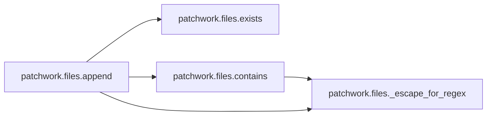

# Patchwork Files

[_Documentation generated by Documatic_](https://www.documatic.com)

<!---Documatic-section-Codebase Structure-start--->
## Codebase Structure

<!---Documatic-block-system_architecture-start--->

<!---Documatic-block-system_architecture-end--->

# #
<!---Documatic-section-Codebase Structure-end--->

<!---Documatic-section-patchwork.files.directory-start--->
## [patchwork.files.directory](4-patchwork_files.md#patchwork.files.directory)

<!---Documatic-section-directory-start--->
<!---Documatic-block-patchwork.files.directory-start--->
<details>
	<summary><code>patchwork.files.directory</code> code snippet</summary>

```python
@set_runner
def directory(c, runner, path, user=None, group=None, mode=None):
    runner('mkdir -p {}'.format(path))
    if user is not None:
        group = group or user
        runner('chown {}:{} {}'.format(user, group, path))
    if mode is not None:
        runner('chmod {} {}'.format(mode, path))
```
</details>
<!---Documatic-block-patchwork.files.directory-end--->
<!---Documatic-section-directory-end--->

# #
<!---Documatic-section-patchwork.files.directory-end--->

<!---Documatic-section-patchwork.files.exists-start--->
## [patchwork.files.exists](4-patchwork_files.md#patchwork.files.exists)

<!---Documatic-section-exists-start--->
<!---Documatic-block-patchwork.files.exists-start--->
<details>
	<summary><code>patchwork.files.exists</code> code snippet</summary>

```python
@set_runner
def exists(c, runner, path):
    cmd = 'test -e "$(echo {})"'.format(path)
    return runner(cmd, hide=True, warn=True).ok
```
</details>
<!---Documatic-block-patchwork.files.exists-end--->
<!---Documatic-section-exists-end--->

# #
<!---Documatic-section-patchwork.files.exists-end--->

<!---Documatic-section-patchwork.files.contains-start--->
## [patchwork.files.contains](4-patchwork_files.md#patchwork.files.contains)

<!---Documatic-section-contains-start--->


### Object Calls

* [patchwork.files._escape_for_regex](4-patchwork_files.md#patchwork.files._escape_for_regex)

<!---Documatic-block-patchwork.files.contains-start--->
<details>
	<summary><code>patchwork.files.contains</code> code snippet</summary>

```python
@set_runner
def contains(c, runner, filename, text, exact=False, escape=True):
    if escape:
        text = _escape_for_regex(text)
        if exact:
            text = '^{}$'.format(text)
    egrep_cmd = 'egrep "{}" "{}"'.format(text, filename)
    return runner(egrep_cmd, hide=True, warn=True).ok
```
</details>
<!---Documatic-block-patchwork.files.contains-end--->
<!---Documatic-section-contains-end--->

# #
<!---Documatic-section-patchwork.files.contains-end--->

<!---Documatic-section-patchwork.files.append-start--->
## [patchwork.files.append](4-patchwork_files.md#patchwork.files.append)

<!---Documatic-section-append-start--->


### Object Calls

* [patchwork.files.exists](4-patchwork_files.md#patchwork.files.exists)
* [patchwork.files.contains](4-patchwork_files.md#patchwork.files.contains)
* [patchwork.files._escape_for_regex](4-patchwork_files.md#patchwork.files._escape_for_regex)

<!---Documatic-block-patchwork.files.append-start--->
<details>
	<summary><code>patchwork.files.append</code> code snippet</summary>

```python
@set_runner
def append(c, runner, filename, text, partial=False, escape=True):
    if isinstance(text, six.string_types):
        text = [text]
    for line in text:
        regex = '^' + _escape_for_regex(line) + ('' if partial else '$')
        if line and exists(c, filename, runner=runner) and contains(c, filename, regex, escape=False, runner=runner):
            continue
        line = line.replace("'", "'\\\\''") if escape else line
        runner("echo '{}' >> {}".format(line, filename))
```
</details>
<!---Documatic-block-patchwork.files.append-end--->
<!---Documatic-section-append-end--->

# #
<!---Documatic-section-patchwork.files.append-end--->

<!---Documatic-section-patchwork.files._escape_for_regex-start--->
## [patchwork.files._escape_for_regex](4-patchwork_files.md#patchwork.files._escape_for_regex)

<!---Documatic-section-_escape_for_regex-start--->
<!---Documatic-block-patchwork.files._escape_for_regex-start--->
<details>
	<summary><code>patchwork.files._escape_for_regex</code> code snippet</summary>

```python
def _escape_for_regex(text):
    regex = re.escape(text)
    regex = regex.replace('\\\\', '\\\\\\')
    regex = regex.replace('\\$', '\\\\\\$')
    regex = regex.replace("\\'", "'")
    return regex
```
</details>
<!---Documatic-block-patchwork.files._escape_for_regex-end--->
<!---Documatic-section-_escape_for_regex-end--->

# #
<!---Documatic-section-patchwork.files._escape_for_regex-end--->

[_Documentation generated by Documatic_](https://www.documatic.com)