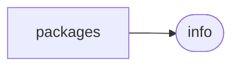
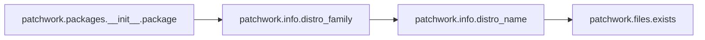

# Patchwork Packages

[_Documentation generated by Documatic_](https://www.documatic.com)

<!---Documatic-section-Codebase Structure-start--->
## Codebase Structure

<!---Documatic-block-system_architecture-start--->

<!---Documatic-block-system_architecture-end--->

# #
<!---Documatic-section-Codebase Structure-end--->

<!---Documatic-section-patchwork.packages.__init__.package-start--->
## [patchwork.packages.__init__.package](8-patchwork_packages.md#patchwork.packages.__init__.package)

<!---Documatic-section-package-start--->


### Object Calls

* [patchwork.info.distro_family](5-patchwork_info.md#patchwork.info.distro_family)

<!---Documatic-block-patchwork.packages.__init__.package-start--->
<details>
	<summary><code>patchwork.packages.__init__.package</code> code snippet</summary>

```python
def package(c, *packages):
    apt = 'DEBIAN_FRONTEND=noninteractive apt-get install -y {}'
    yum = 'yum install -y %s'
    manager = apt if distro_family(c) == 'debian' else yum
    for package in packages:
        c.sudo(manager.format(package))
```
</details>
<!---Documatic-block-patchwork.packages.__init__.package-end--->
<!---Documatic-section-package-end--->

# #
<!---Documatic-section-patchwork.packages.__init__.package-end--->

<!---Documatic-section-patchwork.packages.__init__.rubygem-start--->
## [patchwork.packages.__init__.rubygem](8-patchwork_packages.md#patchwork.packages.__init__.rubygem)

<!---Documatic-section-rubygem-start--->
<!---Documatic-block-patchwork.packages.__init__.rubygem-start--->
<details>
	<summary><code>patchwork.packages.__init__.rubygem</code> code snippet</summary>

```python
def rubygem(c, gem):
    return c.sudo('gem install -b --no-rdoc --no-ri {}'.format(gem))
```
</details>
<!---Documatic-block-patchwork.packages.__init__.rubygem-end--->
<!---Documatic-section-rubygem-end--->

# #
<!---Documatic-section-patchwork.packages.__init__.rubygem-end--->

[_Documentation generated by Documatic_](https://www.documatic.com)